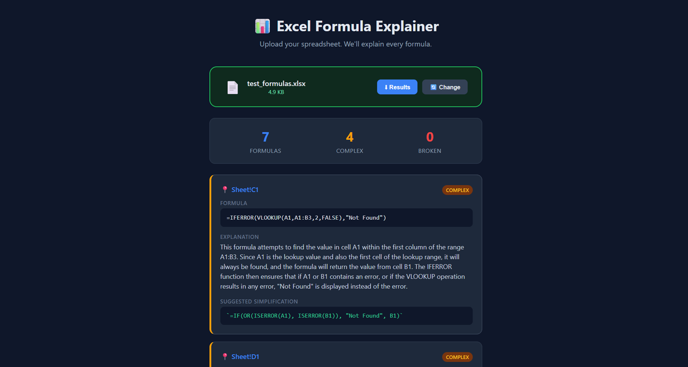

# 📊 Excel Formula Explainer

Upload any Excel file — get instant, plain-English explanations for every formula.



## What It Does

- 🔍 **Finds all formulas** in your `.xlsx` file across every sheet
- ⚠️ **Flags complex formulas** (nested functions, VLOOKUP, INDEX/MATCH, SUMPRODUCT, etc.)
- 🧠 **Explains each formula in plain English** using AI (Google Gemini)
- 🔴 **Detects broken references** (#REF!, #NAME?, #VALUE!, #DIV/0!)
- ✨ **Suggests simplifications** for complex formulas when possible

## How It Works
Upload .xlsx → Analyzer scans every cell → Complex formulas sent to Gemini → Results displayed

**Complexity detection uses two rules:**
1. Formula longer than 50 characters
2. Formula contains tricky functions (VLOOKUP, INDEX, MATCH, IFERROR, SUMPRODUCT, etc.)

## Tech Stack

- **Backend:** Python, Flask
- **AI:** Google Gemini 2.5 Flash
- **Excel Parsing:** openpyxl
- **Frontend:** HTML, CSS, JavaScript
- **Deployment:** Render

## Run Locally

1. Clone the repo:
```bash
   git clone https://github.com/deepakcr7suii/excel-formula-explainer.git
   cd excel-formula-explainer
```

2. Install dependencies:
```bash
   pip install -r requirements.txt
```

3. Create a `.env` file with your Gemini API key:
GEMINI_API_KEY=your_api_key_here
   Get a free key at [Google AI Studio](https://aistudio.google.com/apikey)

4. Run the app:
```bash
   python app.py
```

5. Open `http://localhost:5001` in your browser

## Project Structure
excel-formula-explainer/
├── app.py              # Flask server + routes
├── analyzer.py         # Excel parser + formula detection
├── gemini_helper.py    # AI explanation + simplification
├── templates/
│   └── index.html      # Upload page + results UI
├── requirements.txt
├── .env                # API key (not in repo)
├── LICENSE
└── README.md

## Architecture
┌──────────┐     ┌──────────┐     ┌────────────┐     ┌────────┐
│  Browser  │────▶│  Flask   │────▶│  Analyzer  │────▶│ Gemini │
│  Upload   │◀────│  Server  │◀────│  (openpyxl)│◀────│  AI    │
└──────────┘     └──────────┘     └────────────┘     └────────┘

## License

MIT License — see [LICENSE](LICENSE)

## Author

**Deepak** — [GitHub](https://github.com/deepakcr7suii)